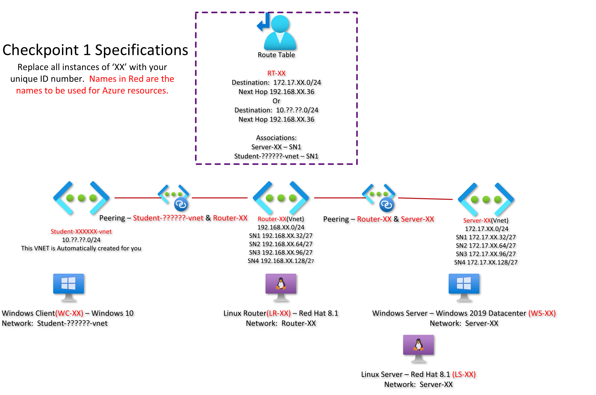

:star2::star2::star2::star2::star2::star2::star2::star2::star2::star2::star2::star2::star2::star2:

- **COURSE INFORMATION: CSN400 Computer Systems Projects**
- **STUDENT’S NAME: Divyansh Dutt** 
- **STUDENT'S NUMBER: 129611208**
- **GITHUB USER_ID: ddutt3-129611208**
- **TEACHER’S NAME: Atoosa Nasiri**


## Table of Contents
- :point_right: [Network Topology](#network-topology)
- :point_right: [Single Line Code Snippet](#single-line-code-snippet)
- :point_right: [Multi Line Bash Script](#multi-line-bash-script)
- :point_right: [Sample Json Objects](#sample-json-objects)
- :point_right: [Sample Table](#sample-table)
- :point_right: [Sample Hperlink](#sample-hyperlink)

##

### *Network Topology* :computer:

##

### *Single Line Code Snippet* :page_with_curl:

` echo ("hello world") `

##

### *Multi Line Bash Script* :page_with_curl:

```bash 
#!/usr/bin/env python3
name = "Divyansh"
age= "24"
print (name + ' is ' +age + ' years old!')
```
##

### *Sample Json Objects* :page_with_curl:

```java
{  
    "employee": {  
        "name":       "sonoo",   
        "salary":      56000,   
        "married":    true  
    }  
}  
```
##

### *Sample Table* :capital_abcd:

| NAME    | AGE     |  OCCUPATION   |
|---------|---------|---------------|
| Divyansh| 24      | does nothing! |
| Avin    | 20      | my brother    |

##

### *Sample Hperlink* :link:

[***:point_right: CHECK MY GITHUB PROFILE HERE :point_left:***](https://github.com/settings/profile)

##
